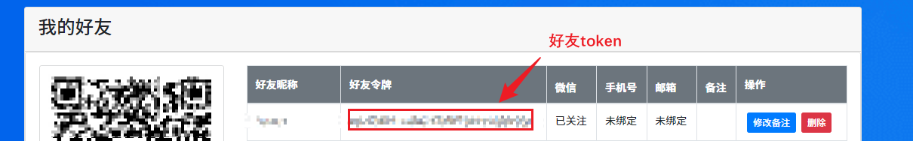

# tech-study(修改自[tech-study-docker](https://github.com/Xu22Web/tech-study-docker))

### 描述 Description

- 基于 `Docker` + `Node.js` 的自动化学习强国工具

### 建议 Suggestion

- 如果感觉 `docker` 配置繁琐，试试 [油猴插件脚本版](https://github.com/Xu22Web/tech-study-js '油猴插件脚本版')

- 如果不熟悉 `docker` 的运行，试试 [Node.js 版](https://github.com/Xu22Web/tech-study-node 'Node.js 版')

### 优点 Advantages

- 易于部署，灵活可用的学习强国 `PC 网页版` 任务解决方案

- 基于 `Node.js` 的控制浏览器的行为，安全高效

- 基于 `PushPlus` 推送功能，通过微信远程接收学习情况和服务运行情况

- 基于 `Email` 推送功能，通过邮箱远程接收学习情况和服务运行情况

### 交流群 Telegram Group

- 链接： [tech-study 互动群](https://t.me/+IJ_YzNc-Iew0MGRl)

- 二维码：

  

注：介于国内敏感，暂时不提供其他交流互动方式。

### 部署与运行 Deploy and Run

1. 安装 `docker` 以及 `docker-compose`

   <details>
   <summary>
   CentOS
   （<a href="https://docs.docker.com/engine/install/centos/">查看官方教程</a>）
   </summary>

   1. 安装 `docker` 

      ```bash
      sudo yum -y update
      # 若没有docker-ce的源，则添加源
      # yum-config-manager --add-repo https://download.docker.com/linux/centos/docker-ce.repo
      # 其他错误
      # yum install -y epel-release yum-utils
      sudo yum -y install docker-ce docker-compose
      ```
      
   2. 运行 `docker`

      ```bash
      sudo systemctl start docker
      sudo systemctl enable docker
      ```

   </details>

   <details>
   <summary>
   Ubuntu
   （<a href="https://docs.docker.com/engine/install/ubuntu/">查看官方教程</a>）
   </summary>

   1. 安装 `docker` 

      ```bash
      # 1)安装 docker 脚本
      sudo curl -fsSL https://get.docker.com | bash -s docker --mirror Aliyun
      
      # 2) 手动安装
      sudo apt update
      # 	安装依赖
      sudo apt install apt-transport-https ca-certificates curl gnupg-agent software-properties-common
      
      # 	导入源仓库的 GPG key
      curl -fsSL https://download.docker.com/linux/ubuntu/gpg | sudo apt-key add -
      #ubuntu 22.04 key管理方式过期
      # mv /etc/apt/trusted.gpg /etc/apt/trusted.gpg.d/
      
      # 	添加 Docker APT 软件源
      sudo add-apt-repository "deb [arch=amd64] https://download.docker.com/linux/ubuntu $(lsb_release -cs) stable"
      
      sudo apt update
      
      # 	安装 Docker 最新版本
      sudo apt install docker-ce docker-ce-cli containerd.io docker-compose
      ```

   2. 运行 `docker` 

      ```sh
      sudo systemctl start docker
      sudo systemctl enable docker
      ```

   </details>

2. 构建`docker` 镜像，创建 `tech-study` 容器

   1. 构建 `docker` 镜像

      ```bash
      docker build -t yimeng/tech-study .
      ```

   2. 创建 `tech-study` 容器

      ```bash
      docker compose up -d
      ```

3. （可选*）`Email` 推送

   1. 更改 `Push  `配置（`config/push.ts`），配置管理员邮箱（`管理员[ 即下方配置的email ]`能接收到服务推送，`用户`只能收到自己的学习推送）

   ```tsx
   const PUSH_CONFIG = {
     // 启用推送
     enabled: true,
     ......
       
     // 设置推送方式为邮箱推送
     pushType: 'email',
     ......
       
     // Email 配置
     email: {
       // SMTP 地址
       smtp: 'smtp.xxx.xxx',
       // SSL 端口
       sslPort: 465,
       // 发送人
       nickname: 'xxx',
       // 邮箱账号
       username: 'xxxxxxxxx@xxx.com',
       // 邮箱授权码
       secretKey: 'xxxxxxxxxxxxxxxx'
     }
   };
   ```

   2. 配置定时任务，每任务可设置一个用户邮箱，注意：==id 必须不同==

   ```tsx
   export const SCHEDULE_CONFIG: Schedule[] = [
     {
       id: 'xxx', // 注意每个用户的 id 必须不同
       nick: 'xxx',
       email: 'xxxxxx@qq.com',
       ......
       cron: '0 0 12 * * ?',
       taskConfig: [true, true, true, true],
       paperExitAfterWrong: false,
       refreshCookieInterval: [60, 120],
     },
   ];
   ```

4. （可选*）启用 `PushPlus` 推送

   1. 在 [PushPlus 官网](https://www.pushplus.plus/ 'PushPlus 官网') 上，注册登录账号。若有其他用户，可添加为好友，发送[好友消息](https://www.pushplus.plus/liaison.html 'PushPlus 好友消息')。

   

   

   2. 更改 `Push` 配置（`config/push.ts`），设置管理员`token`（`管理员`能接收到服务推送，`用户`只能收到自己的学习推送）

   ```js
   const PUSH_CONFIG = {
     // 启用推送
     enabled: true,
     ......
       
     // 推送方式（email, pushpush）
     pushType: 'pushpush',
     // token 配置
     token: 'xxxxxxxxxxxxxxxxxxxxxxxxxx',
     ......
   };
   ```

   3. 查看更改 `Schedule 配置`（`config/schedule.ts`），单或多个定时任务配置，注意：==id 必须不同==

   ```js
   export const SCHEDULE_CONFIG: Schedule[] = [
     {
       id: 'xxx', // 注意每个用户的 id 必须不同
       nick: 'xxx',
       ......
       token: 'xxxxxxxxxxxxxxxxxxxxxxxxxx',
       cron: '0 0 12 * * ?',
       taskConfig: [true, true, true, true],
       paperExitAfterWrong: false,
       refreshCookieInterval: [60, 120],
     },
   ];
   ```

   4. cron 表达式

   ```
     # 关于`node-schedule`定时任务的`cron`表达式
   
     *    *    *    *    *    *
     ┬    ┬    ┬    ┬    ┬    ┬
     │    │    │    │    │    │
     │    │    │    │    │    └ 星期 (0 - 7) (0 或 7 是星期天)
     │    │    │    │    └───── 月 (1 - 12)
     │    │    │    └────────── 日 (1 - 31)
     │    │    └─────────────── 时 (0 - 23)
     │    └──────────────────── 分 (0 - 59)
     └───────────────────────── 秒 (0 - 59，可选)
   ```

5. 重新启动容器即可

   ```bash
   docker restart tech-study
   ```

   
